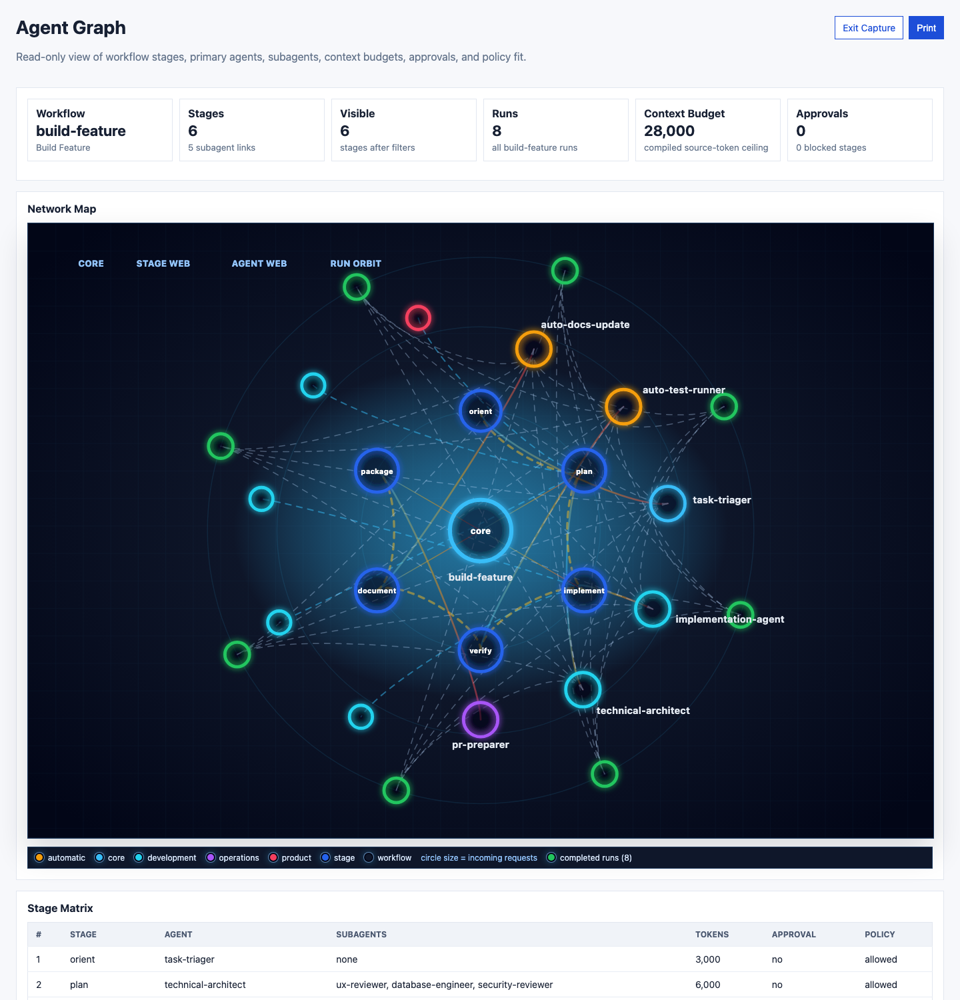
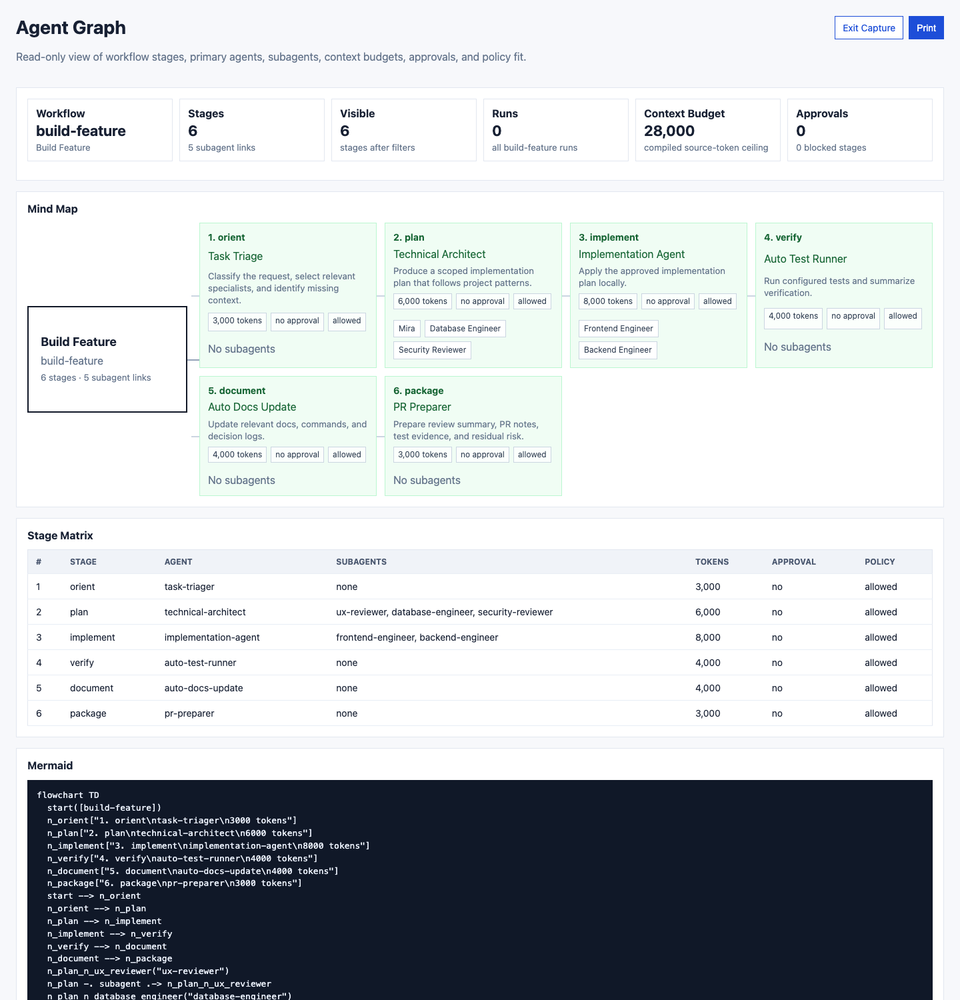
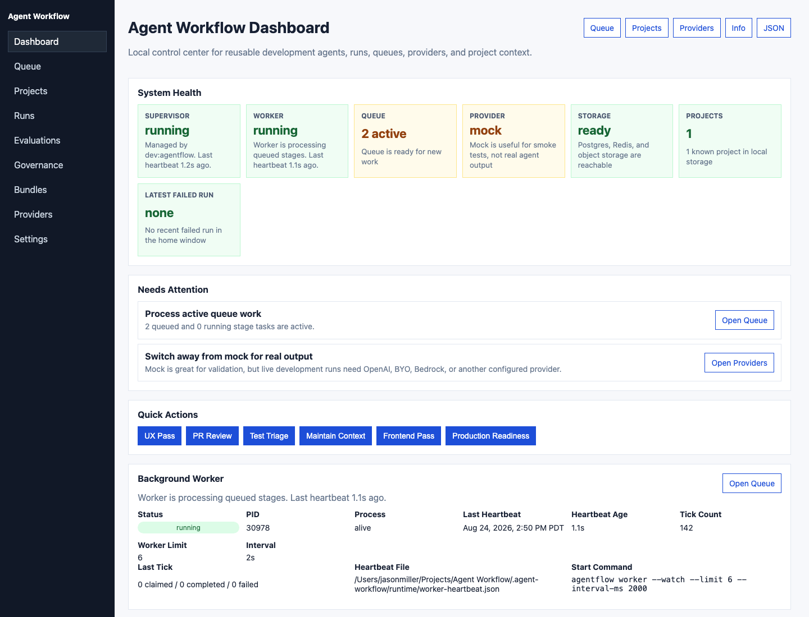
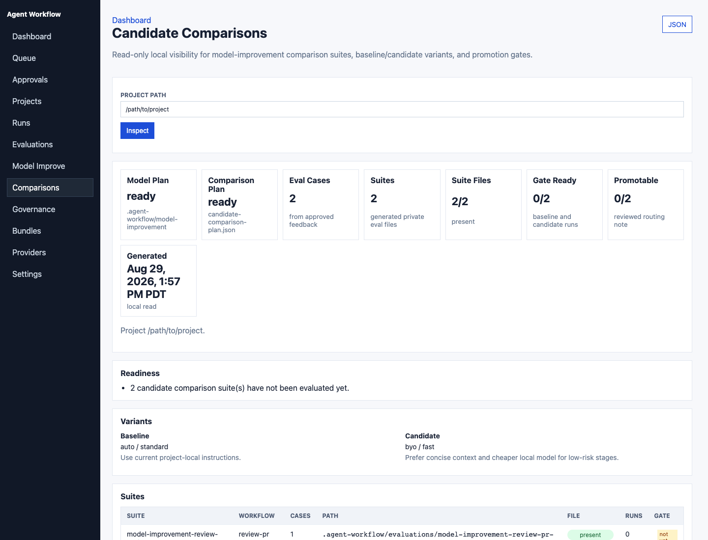

# Agent Workflow

Portable, model-agnostic agent workflows for any codebase. Define reusable AI agent teams and multi-stage workflows, plug in any model provider, and run structured automation across your projects.

## What it does

- **25 specialist agents** — architecture, frontend, backend, security, UX, testing, model improvement, docs, and more
- **9 composable workflows** — build features, review PRs, debug failures, improve model routing, check production readiness
- **BYO model first** — use any OpenAI-compatible model gateway, plus optional OpenAI, Bedrock, or Kiro adapters
- **Any MCP client** — run the same workflows from terminal, VS Code, Cursor, Codex, or automation
- **Adaptive routing** — send cheap stages to local/BYO models, promote stages from feedback, and use stronger providers where needed
- **Cost-optimized routing** — fast models for simple tasks, reasoning models for complex ones
- **Durable execution** — queued stages, receipts, artifacts, and exportable reports
- **Multi-project governance** — read-only health, provider, policy-drift, queue, role, artifact lifecycle, and remediation reporting
- **Trusted workflow bundles** — detached Ed25519 signatures, public-key trust policy, and tamper detection

## Quick Start

Install without cloning:

```bash
npm install --global @jasonneo99/agent-workflow
agentflow-setup
agentflow doctor
agentflow ide-onboard --project /path/to/your/project --write --check
```

For one-off use, run `npx --package @jasonneo99/agent-workflow agentflow -- list`. The package exposes `agentflow`, `agentflow-mcp`, and `agentflow-setup`, and includes the compiled runtime, agents, workflows, and templates. Publishing remains an explicit release action.

Develop from a clone:

```bash
git clone https://github.com/jasonneo99/agent-workflow.git
cd agent-workflow
npm install
cp .env.example .env
npm run setup
```

The interactive setup walks you through provider selection and configuration. Once complete:

```bash
# Verify your provider is working
npm run provider-check

# Start enterprise storage for durable runs
docker compose -f infra/docker-compose.yml up -d
npm run doctor
npm run migrate-storage
npm run bootstrap-storage
npm run validate

# Initialize tailored agent workflow files in your project
npm run onboard-project -- --project /path/to/your/project --profile enterprise --write
npm run ide-onboard -- --project /path/to/your/project --write --check

# Run your first workflow (dry run)
npm run agentflow -- orchestrate --project /path/to/your/project --task "Review code quality" --dry-run

# Run it for real
npm run agentflow -- run-and-watch production-readiness --project /path/to/your/project --task "Review production readiness, UX, SEO, mobile experience, security, and launch risks"
```

For a no-services setup, initialize a project with `--profile simple` and use `npm run compile` to produce file-based briefs.

`onboard-project` is dry-run by default. Add `--write` to create `AGENTS.md` and tailored `.agent-workflow/` files, including `.agent-workflow/bundle-state.json` for future upgrade previews; existing files are skipped unless `--force` is provided. Use `init-project` only when you want the generic template instead of stack-detected onboarding.

## Providers

| Provider | Models | Config |
|----------|--------|--------|
| `auto` | Smart per-stage routing across configured providers | Any configured provider |
| `mock` | None (deterministic) | No config needed |
| `byo` | Any OpenAI-compatible gateway | `BYO_MODEL_BASE_URL` + `BYO_MODEL_NAME` |
| `openai` | GPT-4o, GPT-5.5 | `OPENAI_API_KEY` |
| `bedrock` | Nova Pro/Lite, Claude, Llama, Mistral | AWS credentials |
| `openai-compatible` | Legacy BYO-compatible alias | `OPENAI_COMPATIBLE_BASE_URL` + model name |
| `kiro` | Optional Kiro CLI adapter | `kiro-cli login` or `KIRO_API_KEY` |

Switch providers by changing `DEFAULT_MODEL_PROVIDER` in `.env`:

```bash
# Smart routing across configured providers
DEFAULT_MODEL_PROVIDER=auto
AGENTFLOW_AUTO_PROVIDERS=byo,bedrock,openai,openai-compatible,kiro

# BYO model gateway: Ollama, LM Studio, vLLM, LiteLLM, internal routers, etc.
DEFAULT_MODEL_PROVIDER=byo
BYO_MODEL_BASE_URL=http://localhost:11434/v1
BYO_MODEL_NAME=llama3.1
BYO_MODEL_API_KEY=

# AWS Bedrock
DEFAULT_MODEL_PROVIDER=bedrock
BEDROCK_MODEL=amazon.nova-pro-v1:0
AWS_REGION=us-east-1

# Kiro CLI
DEFAULT_MODEL_PROVIDER=kiro
KIRO_CLI_BIN=kiro-cli
KIRO_AGENT=

# OpenAI
DEFAULT_MODEL_PROVIDER=openai
OPENAI_API_KEY=sk-...
OPENAI_MODEL=gpt-4o
```

For a fresh install, BYO can be configured either through `npm run setup` or by manually adding those four `BYO_*` lines to `.env`. After that, `npm run provider-check` verifies that the endpoint is reachable and the model is available.

## Model Tier Routing

Agents are assigned cost tiers (`fast`, `standard`, `reasoning`). With `DEFAULT_MODEL_PROVIDER=auto`, Agent Workflow chooses a ready provider for each tier. BYO/local models are preferred for cheaper stages, OpenAI is preferred for reasoning when configured, and Bedrock is included when AWS credentials are valid.

Provider adapters then route to the right model:

| Tier | Use case | Default routing behavior |
|------|----------|--------------------------|
| `fast` | Triage, docs, test running | Provider adapter chooses a low-cost/low-effort path where supported |
| `standard` | Implementation, frontend, backend | Provider adapter uses its configured default model |
| `reasoning` | Architecture, security, UX review | Provider adapter chooses higher effort/capability where supported |

Override per-tier models where the provider supports it, such as `BEDROCK_MODEL_FAST`, `BEDROCK_MODEL_STANDARD`, and `BEDROCK_MODEL_REASONING`.

## Architecture

```
agents/          — Reusable agent cards (YAML)
workflows/       — Multi-stage workflow definitions (YAML)
packages/        — Runtime: model providers, context compiler, workflow engine
apps/cli/        — CLI interface
apps/worker/     — Background task processor
apps/mcp/        — MCP server for IDE integration
infra/           — Docker Compose for enterprise storage (Postgres, Redis, MinIO)
templates/       — Project initialization templates
```

## Commands

```bash
npm run setup                  # Interactive onboarding
npm run check                  # Contributor checks before opening a PR
npm run release:check -- --allow-current-version # Verify release readiness without changing files
npm run release:prepare -- --dry-run # Preview signed npm release prep
npm run provider-check         # Verify model provider
npm run validate               # Validate agent/workflow definitions
npm run agentflow -- contract-test # Contract-test definitions and mock provider output
npm run bundle-manifest        # Inspect versioned bundle checksums
npm run agentflow -- bundle-compat # Check runtime, Node.js, MCP compatibility, and migration notes
npm run agentflow -- bundle-upgrade-preview -p . # Preview project bundle migration notes without changing files
npm run agentflow -- definition-migrations -p . # Show definition changes, upgrade steps, validation, and rollback
npm run agentflow -- bundle-adopt -p . --force # Record current bundle as the reviewed project baseline
npm run doctor                 # Check local services
npm run dashboard              # Inspect runs, providers, usage, projects, roles, artifacts, graph, and bundle readiness

# Project operations
npm run init-project -- -p .   # Install agent workflow into a project
npm run onboard-project -- -p . # Analyze stack and recommend tailored config
npm run index-project -- -p .  # Index project files for context
npm run index-project -- -p . --incremental # Refresh only changed files after a baseline exists
npm run index-project -- -p . --incremental --since-commit origin/main # CI-style changed-file refresh
npm run index-project -- -p . --incremental --watch # Keep local context warm
npm run compile -- -w build-feature -p . -t "task"  # Compile a workflow brief, including approved local tuning notes
npm run agentflow -- schemas       # List JSON Schemas for agents, workflows, project config, schedules, and bundle state
npm run agentflow -- schemas -p . --write-vscode # Add YAML validation to VS Code/Cursor workspace settings
npm run agentflow -- workflow-graph -w build-feature -p . # Preview stages, approvals, agents, and context budgets
npm run agentflow -- workflow-graph -w build-feature -p . --mermaid # Renderable workflow graph
npm run bundle-registry      # Inspect trusted bundle registry entries and local install status
npm run bundle-pin -- -p .   # Dry-run a project-local bundle version pin
npm run bundle-lifecycle-plan -- -p . # Dry-run reviewed upgrade command plan

# Workflow execution (requires enterprise storage)
npm run dev:agentflow       # Start services, dashboard, and supervised worker
npm run dev:agentflow:stop  # Stop the local dashboard and worker
npm run worker -- --watch --worker-id local-dev # Start a named worker for queue ownership visibility
npm run worker -- --watch --project /path/to/project --concurrency 3 --limit 12 # Scope a worker lane to one project
npm run worker -- --watch --project /path/to/project # Use project worker_pool defaults from .agent-workflow/project.yaml
npm run worker -- --watch --worker-id frontend-lane --project /path/to/project --concurrency 2 # Add another visible worker lane
AGENTFLOW_PROJECT=/path/to/project AGENTFLOW_WORKER_POOL_PROFILE=split-review npm run dev:agentflow # Start the dashboard plus named project worker lanes
npm run agentflow -- recover-leases # Requeue expired worker-owned tasks
npm run agentflow -- orchestrate -p . -t "task"     # Auto-plan and run
npm run agentflow -- run-and-watch build-feature -p . -t "task" # Incrementally index, run, export, summarize
npm run agentflow -- run-and-watch build-feature -p . -t "task" --worker-concurrency 3 # Process stages concurrently within policy
npm run agentflow -- run-and-watch build-feature -p . -t "task" --full-index # Force a clean full context refresh
npm run agentflow -- run build-feature -p . -t "task"  # Run specific workflow
npm run agentflow -- run build-feature -p . -t "task" --policy-profile staging # Apply target guardrails
npm run agentflow -- agent-task security -p . -t "task"  # Run single agent
npm run worker -- --limit 6    # Process queued tasks
npm run worker:daemon          # Continuously process queued tasks locally

# Inspection
npm run status                 # List recent runs
npm run agentflow -- resume-run --run <id> # Resume unfinished stages from the last completed checkpoint
npm run agentflow -- replay-run --run <id> # Queue a fresh replay from stored run metadata
npm run agentflow -- approvals # Review pending agent-requested actions
npm run agentflow -- approvals --approve <id> --actor "Your Name" --actor-role approver # Record role-aware approval
npm run agentflow -- roles -p . # Inspect team role config and recent approval decisions by role
npm run agentflow -- artifact-lifecycle -p . # Inspect read-only artifact inventory and lifecycle hints
npm run agentflow -- artifact-lifecycle -p . --prune-plan # Preview exact artifact prune candidates without deleting anything
npm run agentflow -- request-approval -p . --type deployment --target production --rationale "Ready to ship" # Queue a deployment approval
npm run agentflow -- gate -r <id> -p . # Enforce project-local quality/cost gates
npm run agentflow -- observe -r <id> --json # Export OpenTelemetry-style spans and metrics
npm run export-run -- --run <id> --scrub # Export a shareable redacted report
npm run agentflow -- quality-report -r <id>  # View cost, routing, fallback, and quality scores
npm run agentflow -- evaluate -s evaluations/synthetic-provider-comparison.yaml -p . --dry-run # Preview an eval matrix
npm run agentflow -- run-and-watch model-improvement -p . -t "Improve quality while reducing cost" # Diagnose prompt, context, eval, routing, retrieval, or fine-tune paths
npm run agentflow -- feedback -r <id> --rating accepted  # Teach future runs from outcomes
npm run agentflow -- preference-scorecard -p . # See agent/provider/tier performance
npm run agentflow -- tuning-proposals -p . # Generate reviewable tuning suggestions
npm run agentflow -- queue-tuning-approvals -p . --ids all # Dry-run approval queue
npm run agentflow -- tuning-approvals -p . --approve tune-001 # Approve a queued item
npm run agentflow -- generate-tuning-patches -p . # Dry-run reviewable patch-plan files
npm run agentflow -- model-improvement-plan -p . # Dry-run scrubbed eval/dataset plan files
npm run agentflow -- candidate-comparison-plan -p . # Dry-run baseline/candidate eval suites
npm run agentflow -- promotion-note-plan -p . # Dry-run reviewed routing-note plan from promotable comparisons
npm run agentflow -- apply-tuning-patches -p . # Dry-run applied local tuning notes
npm run agentflow -- apply-tuning-proposals -p . --ids all # Dry-run project-local tuning overlays
npm run artifacts -- -r <id>   # View run artifacts
npm run agentflow -- dashboard # Start local web dashboard
```

The dashboard includes a **Graph** view for inspecting workflow stages, primary
agents, subagents, context budgets, approval points, and policy fit before
queueing work.





The dashboard includes an **Evaluations** view for comparing provider, model
tier, prompt, quality, latency, fallback, estimated cost, and feedback results.
It also includes a **Model Improvement** view for scorecard health, eval
coverage, tuning proposal mix, routing recommendations, and promotion readiness.
The **Comparisons** view shows written candidate comparison plans, generated
private eval suites, baseline/candidate variants, quality and latency deltas,
gate readiness, promotion recommendations, and promotion gate commands.





Execution policy profiles (`local`, `staging`, and `production`) control
autonomy, commands, and write access without creating separate workflow
storage. Every queued run records the resolved policy snapshot used by its
worker. Narrow approval rules can auto-execute recurring low-risk actions after
the normal allowlist/blocklist checks pass. See [Autonomy Policy](docs/autonomy.md).

## IDE Clients

Agent Workflow is not tied to a specific coding environment. Use the CLI directly, or expose the same workflows through MCP in VS Code, Cursor, Codex, or another MCP-capable client.

See [docs/mcp-clients.md](docs/mcp-clients.md) for VS Code, Cursor, and Codex config examples.

## Docs

- [User Guide](docs/user-guide.md): full install and usage guide
- [Provider Matrix](docs/providers.md): BYO, OpenAI, Bedrock, OpenAI-compatible, and Kiro setup
- [MCP Client Setup](docs/mcp-clients.md): VS Code, Cursor, Codex, and generic MCP clients
- [Definition Migrations](docs/definition-migrations.md): upgrade and rollback guidance for reusable agent/workflow contracts
- [Contract Tests](docs/contract-tests.md): verify custom agents, workflows, and provider adapters
- [Model Improvement Workflow](docs/model-improvement.md): diagnose quality and cost issues without exporting private data by default
- [Model Improvement Walkthrough](docs/model-improvement-walkthrough.md): follow the local feedback, comparison, and promotion-note loop end to end
- [Contributing](CONTRIBUTING.md): local checks, contribution boundaries, and PR guidance
- [Security Policy](SECURITY.md): responsible disclosure, scope, and local automation safety boundaries
- [Release Guide](docs/release.md): contributor checks, maintainer signing, and Trusted Publishing
- [Integration Examples](docs/integration-examples.md): copyable model-provider and IDE/client examples
- [Scrubbed Examples](docs/examples/README.md): synthetic exports safe for docs and issue reports
- [Bundle Manifest](agent-workflow.bundle.json): versioned reusable agent/workflow bundle checksum
- [Agent Roster](docs/agent-roster.md): available agents
- [Architecture](docs/architecture.md): runtime and storage design
- [Roadmap](docs/roadmap.md): shared-platform direction and next implementation phases
- [Evaluation Harness](docs/evaluations.md): provider, tier, and prompt comparison suites
- [Open Source Boundary](docs/open-source-boundary.md): what belongs in the framework versus private product agent engines
- [Comparison, Gap, And Synergy](docs/comparison-gap-synergy.md): where shared platform IP helps and where product IP should stay private
- [Autonomy Policy](docs/autonomy.md): automation levels and guardrails

## Enterprise Storage

For durable execution with run history, a dashboard, and artifact storage:

```bash
docker compose -f infra/docker-compose.yml up -d
npm run migrate-storage
npm run bootstrap-storage
npm run doctor
```

For file-based output only (no Docker required), use `--profile simple` during project init.

## Adding Your Own Agents

Create a YAML file in your project's `.agent-workflow/agents/` directory:

```yaml
id: my-specialist
display_name: My Specialist
category: development
purpose: Do a specific thing well.
model_tier: standard    # fast | standard | reasoning
autonomy: 3
use_when:
  - relevant keyword
can:
  - specific_capability
outputs:
  schema: structured_summary
prompt: |
  Your agent instructions here.
```

## Adding Workflows

Create a YAML file in `workflows/`:

```yaml
id: my-workflow
name: My Custom Workflow
description: What this workflow does.
lead: workflow-orchestrator
stages:
  - id: analyze
    agent: technical-architect
    goal: Understand the problem.
    context:
      max_tokens: 4000
    output: analysis
  - id: implement
    agent: implementation-agent
    goal: Make the changes.
    context:
      max_tokens: 6000
    output: change_summary
```

## Cost Optimization

- **Model tier routing** — fast agents use cheap models, reasoning agents use capable ones
- **Incremental context indexing** — reuses unchanged summaries, refreshes changed files first, and prunes deleted summaries after a baseline exists
- **Dashboard savings estimates** — shows real-provider mix, latency, compact prompt tokens, and estimated indexed-context tokens avoided, with mock/test runs excluded by default
- **Dashboard control center** — left-nav pages for Queue, Projects, Runs, Providers, Settings, and home health cards
- **Project dashboard** — inspect per-project context files, indexed summaries, memory, recent runs, and project-scoped quick actions
- **Editor validation** — ship JSON Schemas for agents, workflows, project config, and schedules, with VS Code/Cursor YAML associations
- **Queue control panel** — inspect queued/running/failed workflow runs, process worker batches, requeue interrupted stages, retry failed stages, or cancel active work
- **Approval inbox** — review, approve, or reject agent-requested commands and file writes when project policy requires approval
- **Reusable approval rules** — auto-execute narrowly scoped low-risk local actions without expanding the project policy boundary
- **OpenTelemetry-style observability** — export run spans and metrics without prompt or artifact payload bodies
- **Local dev supervisor** — run `npm run dev:agentflow` to start services, dashboard, worker, and heartbeat monitoring together
- **Background worker heartbeat** — run `npm run worker:daemon` and see live worker status in the dashboard
- **Conditional skipping** — orchestration skips redundant steps when prior steps found nothing
- **Persistent memory** — stores findings so future runs skip re-discovering known-good areas
- **Batched workflows** — `production-readiness` runs 4 specialist reviews in one pass with shared context

## Contributing

1. Fork the repo
2. Create a feature branch
3. Check the [Open Source Boundary](docs/open-source-boundary.md) before adding product-specific agent behavior
4. Run `npm run check` before submitting
5. Open a PR with a clear description of what changed and why

See [CONTRIBUTING.md](CONTRIBUTING.md) for setup, agent/workflow guidance, docs expectations, and release boundaries.

## License

MIT
