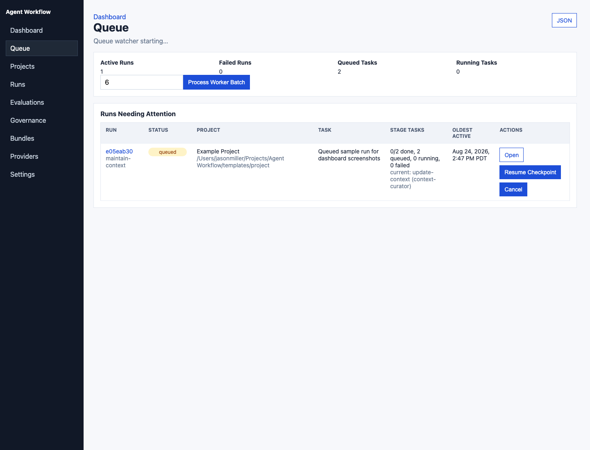
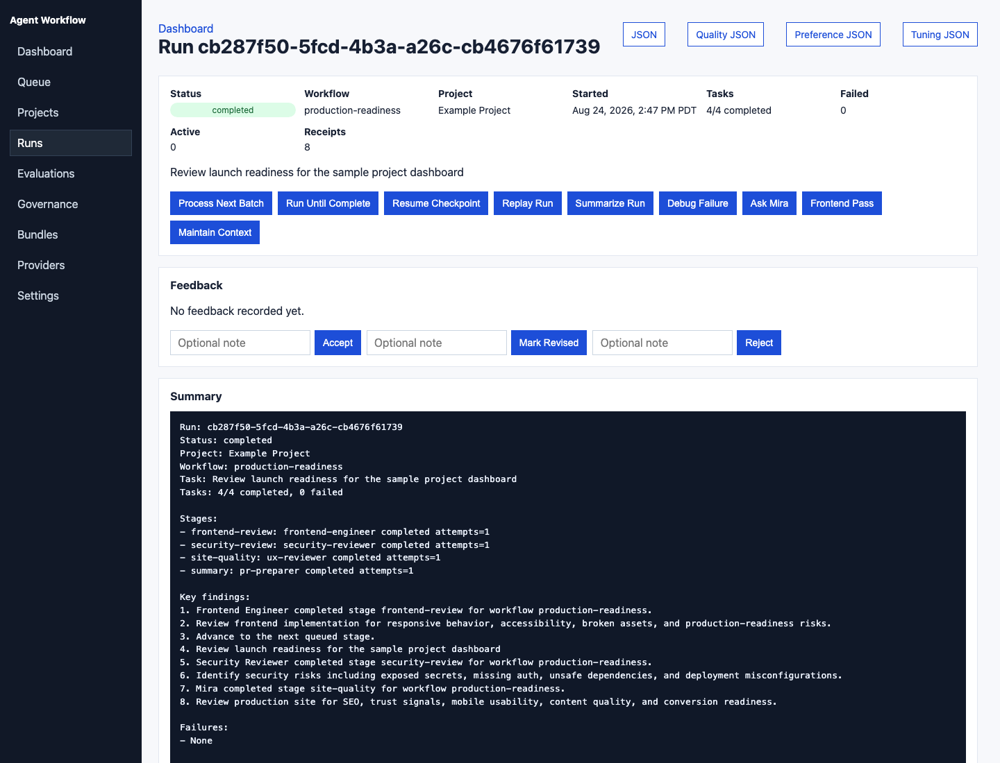

# Documentation

Start here if you are deciding how to install, configure, or run Agent Workflow.

## Recommended Reading Order

1. [User Guide](user-guide.md): install, configure a provider, initialize a project, run workflows, inspect results.
2. [Provider Matrix](providers.md): BYO model setup, OpenAI, Bedrock, OpenAI-compatible legacy config, and optional Kiro CLI adapter.
3. [MCP Client Setup](mcp-clients.md): use the same local workflow server from VS Code, Cursor, Codex, or another MCP-capable client.
4. [Package And Install](packaging.md): install the compiled CLI and MCP server without cloning.
5. [Contributing](../CONTRIBUTING.md): local checks, contribution boundaries, and PR guidance.
6. [Security Policy](../SECURITY.md): responsible disclosure, scope, and local automation safety boundaries.
7. [Release Guide](release.md): contributor-safe checks, maintainer signing, and Trusted Publishing.
8. [Bundle Trust](bundle-trust.md): verify signatures and manage trusted workflow-bundle signer keys.
9. [Backup And Recovery](recovery.md): read-only backup inventory, restore-drill verification, and recovery procedure.
10. [Governed Server Mode](server-mode.md): future opt-in shared runtime contract with secure local-first defaults.
11. [Definition Migrations](definition-migrations.md): upgrade and rollback guidance for reusable agent/workflow contracts.
12. [Contract Tests](contract-tests.md): verify custom agents, workflows, and provider adapters.
13. [Integration Examples](integration-examples.md): copyable model-provider and IDE/client examples.
14. [Agent Roster](agent-roster.md): built-in agents and automatic agents.
15. [Architecture](architecture.md): runtime, storage, indexing, safe actions, and model portability.
16. [Evaluation Harness](evaluations.md): compare providers, model tiers, prompts, quality, latency, fallback, and estimated cost.
17. [Model Improvement Workflow](model-improvement.md): diagnose quality, cost, prompt, context, eval, routing, retrieval, or fine-tune paths.
18. [Model Boundary](model-boundary.md): what Agent Workflow can plan versus what external/private model systems own.
19. [Model Improvement Walkthrough](model-improvement-walkthrough.md): end-to-end local evidence, cost-saving, personalization, comparison, and promotion-note flow.
20. [Roadmap](roadmap.md): shared-platform direction and next implementation phases.
21. [Open Source Boundary](open-source-boundary.md): what belongs in the framework versus private product agent engines.
22. [Comparison, Gap, And Synergy](comparison-gap-synergy.md): where shared platform IP helps and where product IP should stay private.
23. [Autonomy Policy](autonomy.md): what each autonomy level allows.
24. [Profiles](profiles.md): enterprise, simple, and project-specific initialization profiles.
25. [Tellara Integration](tellara-integration.md): Tellara-specific setup and examples.
26. [Codex MCP Install](mcp-codex-app.md): Codex-specific MCP setup. Use [MCP Client Setup](mcp-clients.md) for generic clients.
27. [Scrubbed Examples](examples/README.md): synthetic shareable exports for docs and issue reports.

## Fast Path

```bash
git clone https://github.com/jasonneo99/agent-workflow.git
cd agent-workflow
npm install
cp .env.example .env
npm run setup
npm run provider-check
docker compose -f infra/docker-compose.yml up -d
npm run doctor
npm run migrate-storage
npm run bootstrap-storage
npm run server-readiness
npm run server-projects
npm run server-resolve-project -- --project-id <project-id>
npm run server-request-preview -- --project-id <project-id> --workflow review-pr --task "Review the current changes"
npm run server-route-preview -- --project-id <project-id> --workflow review-pr --task "Review the current changes"
npm run check
npm run bundle-manifest
```

Then initialize a target project:

```bash
npm run onboard-project -- --project /path/to/project --profile enterprise --write
npm run agentflow -- run-and-watch production-readiness \
  --project /path/to/project \
  --task "Review production readiness, UX, SEO, mobile experience, security, and launch risks" \
  --index-max-files 100 \
  --worker-limit 6
npm run agentflow -- quality-report --run <run-id>
npm run agentflow -- evaluate --suite evaluations/synthetic-provider-comparison.yaml --project . --dry-run
npm run agentflow -- feedback --run <run-id> --rating accepted --note "Good production-readiness scope"
npm run agentflow -- preference-scorecard --project /path/to/project
npm run agentflow -- tuning-proposals --project /path/to/project
npm run agentflow -- run-and-watch model-improvement --project /path/to/project --task "Improve quality while reducing cost"
npm run agentflow -- queue-tuning-approvals --project /path/to/project --ids all --write
npm run agentflow -- tuning-approvals --project /path/to/project --approve tune-001 --reviewer "Your Name"
npm run agentflow -- generate-tuning-patches --project /path/to/project
npm run agentflow -- generate-tuning-patches --project /path/to/project --write
npm run agentflow -- apply-tuning-patches --project /path/to/project
npm run agentflow -- apply-tuning-patches --project /path/to/project --write
npm run agentflow -- apply-tuning-proposals --project /path/to/project --ids all
npm run agentflow -- apply-tuning-proposals --project /path/to/project --approved
npm run agentflow -- apply-tuning-proposals --project /path/to/project --ids tune-001,tune-004 --write
npm run export-run -- --run <run-id> --scrub
```

Compiled briefs automatically include approved project-local tuning notes from `.agent-workflow/tuning/` with conservative context caps.
Use `--scrub` when exporting reports for docs, issues, or public sharing.
See [Scrubbed Examples](examples/README.md) for safe sample Markdown and JSON exports.
The root `agent-workflow.bundle.json` records reusable agent/workflow bundle version, source, compatibility, file checksums, and migration notes.

## Dashboard Preview

The local dashboard gives developers a control center for run health, queue recovery, provider routing, project context, workflow graphs, role governance, artifact lifecycle visibility, model-improvement evidence, candidate comparisons, and run evidence.






## BYO Model Config

For local models, hosted gateways, enterprise routers, LiteLLM, vLLM, LM Studio, Ollama, or any OpenAI-compatible chat-completions endpoint:

```env
DEFAULT_MODEL_PROVIDER=byo
BYO_MODEL_BASE_URL=http://localhost:11434/v1
BYO_MODEL_NAME=llama3.1
BYO_MODEL_API_KEY=not-required
```

Run:

```bash
npm run provider-check
```

## Client Model

The editor or agent client is only the control surface. The model provider lives in Agent Workflow's `.env`.

- Terminal: run `npm run agentflow -- ...`
- VS Code: configure `.vscode/mcp.json`
- Cursor: configure `.cursor/mcp.json`
- Codex: configure `~/.codex/config.toml` or install the optional personal plugin
