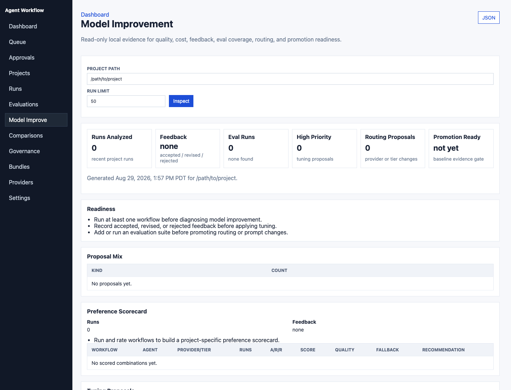
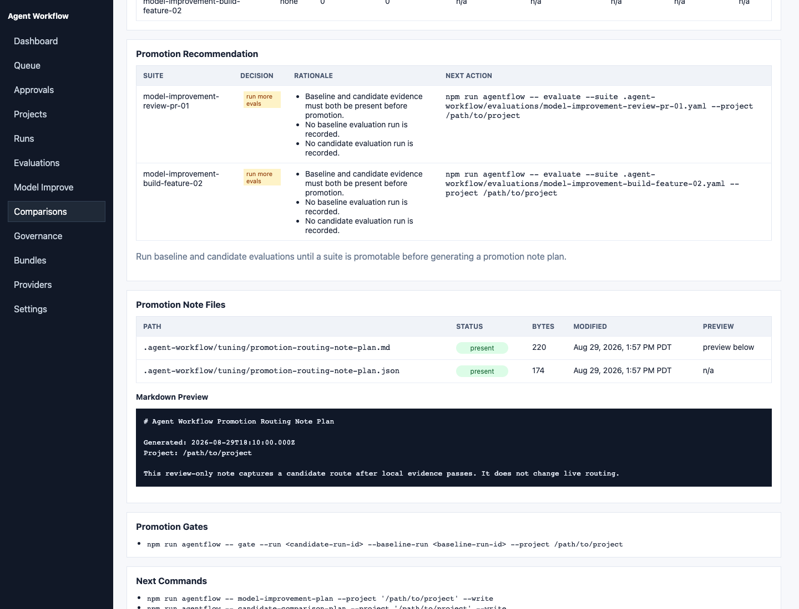

# Model Improvement Workflow

The `model-improvement` workflow helps local developers decide how to improve
agent quality while keeping cost under control. It is provider-neutral and
project-local by default.

Use it when a workflow is too expensive, too slow, inconsistent, or producing
answers that need too much manual correction.

For a complete command-by-command example, see the
[Model Improvement Walkthrough](model-improvement-walkthrough.md).
For the open-source/private-system boundary, see
[Model Boundary](model-boundary.md).

## What It Diagnoses

The workflow asks which lever is most likely to help:

- Better project context or retrieval
- Prompt or agent-instruction tuning
- Different model-tier routing
- Fallback threshold changes
- More evaluation coverage
- Provider-side fine tuning, only when cheaper fixes are not enough

Fine tuning is treated as an evidence-backed option, not the default answer.
Agent Workflow does not include GPU training infrastructure, model registries,
private datasets, or automatic dataset uploads in the open source core.

## Agents

- `model-improvement-diagnostician`: classifies the quality or cost issue and
  recommends the smallest effective fix.
- `eval-curator`: turns explicitly approved feedback into scrubbed local eval
  case proposals.
- `routing-optimizer`: recommends provider, tier, fallback, and promotion
  changes from quality, latency, cost, and feedback evidence.

## Run It

```bash
npm run agentflow -- run-and-watch model-improvement \
  --project /path/to/project \
  --task "Find the cheapest way to improve review-pr quality without losing security coverage"
```

For a plan-only pass:

```bash
npm run compile -- \
  --workflow model-improvement \
  --project /path/to/project \
  --task "Diagnose why frontend review output is inconsistent"
```

From MCP clients such as Codex, VS Code, or Cursor, ask:

```text
Use Agent Workflow to run model-improvement on this project and diagnose how to
reduce token cost while preserving review quality.
```

## Dashboard

Open the local dashboard at `/model-improvement?project=/path/to/project` to
inspect scorecard health, feedback coverage, evaluation coverage, tuning
proposal mix, routing recommendations, and promotion readiness. The dashboard
view is read-only and uses existing project-local evidence.



Open `/candidate-comparisons?project=/path/to/project` to inspect written
candidate comparison plans, generated private evaluation suite files,
baseline/candidate variants, evaluation outcomes, quality and latency deltas,
gate readiness, promotion recommendations, written promotion note files, and
promotion gate commands.




For tools and IDE integrations, the same report is available as JSON:

```text
/api/model-improvement?project=/path/to/project
/api/candidate-comparisons?project=/path/to/project
```

## Evidence To Include

The workflow is most useful after you have at least one of these:

- A completed run with a quality report
- Accepted, revised, or rejected feedback on a run
- A private eval suite under `.agent-workflow/evaluations/`
- Provider routing receipts from `DEFAULT_MODEL_PROVIDER=auto`
- A known failure mode, such as weak UX review or noisy implementation plans

Useful commands:

```bash
npm run agentflow -- quality-report --run <run-id>
npm run agentflow -- feedback --run <run-id> --rating revised --note "Good context, but too expensive for docs-only stages"
npm run agentflow -- preference-scorecard --project /path/to/project
npm run agentflow -- tuning-proposals --project /path/to/project
npm run agentflow -- model-improvement-plan --project /path/to/project
npm run agentflow -- evaluate --suite evaluations/synthetic-provider-comparison.yaml --project /path/to/project --dry-run
```

After approving tuning proposals with `queue-tuning-approvals` and
`tuning-approvals`, run `model-improvement-plan` to prepare scrubbed eval-case
and provider dataset-plan proposals. The command is a dry run unless `--write`
is passed. Written files stay under `.agent-workflow/model-improvement/`.

Then prepare an opt-in baseline-versus-candidate comparison plan:

```bash
npm run agentflow -- candidate-comparison-plan \
  --project /path/to/project \
  --baseline-provider auto \
  --baseline-tier standard \
  --candidate-provider auto \
  --candidate-tier reasoning
```

This command generates private evaluation suite YAML and promotion gate commands
from the scrubbed model-improvement plan. It does not run models or call provider
fine-tune APIs. With `--write`, files are written only under
`.agent-workflow/model-improvement/` and `.agent-workflow/evaluations/`.

## Safety Boundary

The workflow may recommend eval cases, dataset shapes, or fine-tune experiments,
but exporting examples or starting provider jobs requires explicit project-local
approval. Keep private cases under ignored project paths such as
`.agent-workflow/evaluations/`.

Shared docs can describe the method. They should not contain customer prompts,
private scoring formulas, proprietary ranking logic, secrets, or production
routing policies.

## Promotion Rule

Adopt a prompt, context, routing, retrieval, or fine-tuning change only after a
baseline-versus-candidate comparison passes the project evaluation gate.

```bash
npm run agentflow -- gate --run <candidate-run-id> --baseline-run <baseline-run-id> --project /path/to/project
```

After the dashboard shows `propose_routing_note`, prepare a reviewed
project-local promotion note plan from the Candidate Comparisons page, or from
the CLI:

```bash
npm run agentflow -- promotion-note-plan --project /path/to/project
npm run agentflow -- promotion-note-plan --project /path/to/project --write
```

The command is a dry run by default. With `--write`, it writes only
`.agent-workflow/tuning/promotion-routing-note-plan.md` and
`.agent-workflow/tuning/promotion-routing-note-plan.json`. It does not update
active routing preferences. Refresh Candidate Comparisons afterward to inspect
the written file status and markdown preview.
